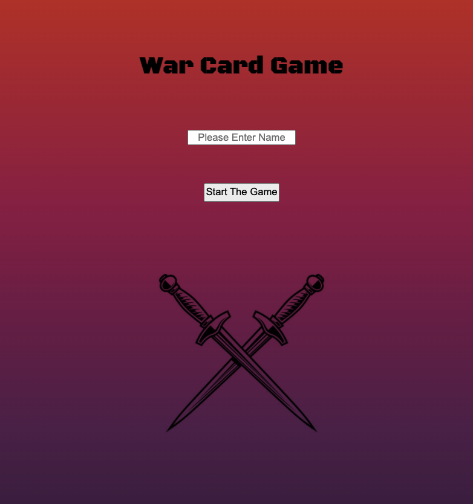

# Project 1: War Card Game

If you love card games but do not have any cards in front of you, don't fear for my first project I created the famous War Card Game accessible online!

Live Link: https://mavicmo.github.io/warcardgame/

# Technologies

HTHML
CSS
JAVASCRIPT

# How to Play

There are a few notes to keep in mind:

- The main point of the game is to win all 52 Cards.
- Higher value number will beat the lower value number in each round.
- If the two numbers are the same, they will go into a war mode where 4 more cards from each deck will be drawn and the last two cards will go into a round of war again for winners take all.
- If the last two cards are the same again, they go to another war untill there is a clear winner.

Instructions:
First enter your name.
Click 'Player 1 Draw' Start playing!

Notes:
You are able to reset the game at any point.
There will be a display of the winner when its determined.

# Screenshots

# Wire Frame

https://git.generalassemb.ly/flex-125/project-1/issues/18

# MVP Goals

MVP Goals
[x] As a player, I want my game to grab 26 cards from the other side of the deck.
[x] As a player, I would like to have the player again button to continue to play the game without refreshing the game.
[x] As a player, I would the user to click the deck so it shows it face up to face the other place
[x] As a player, I would like them to click four times for the war when the initial cards are the same rank

Completed all my MVP Goals

# Stretch Goals

Stretch Goals
[x] As a player, I would design the game to look well
[x] As a player, I would like to allow the user to add their name to display it on the page
[x] As a player, i would like to make the opponent either another player or a AI

Completed all my Stretch Goals

# Next Steps

[ ] When a war occurs, to display the other three cards that are going to be in the war
[ ] Add animation
